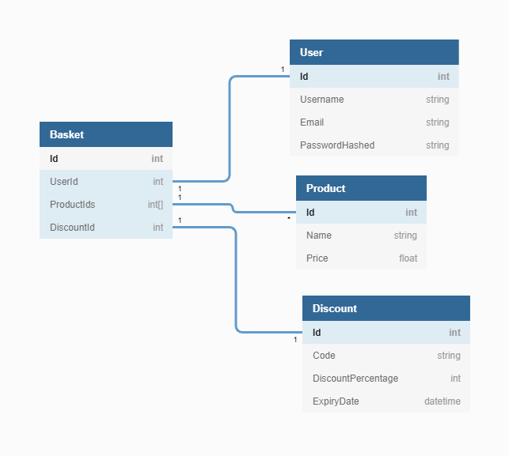

# 288 Group Developer Test

## Initial ERD

From reading the user stories I produced an initial ERD to start thinking about how to represent the domain in a relational database.

The main difference in the implemented version is that there's a link table between Basket and Product because a Many to Many relationship was uncovered.
